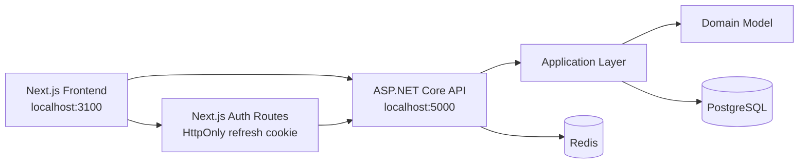
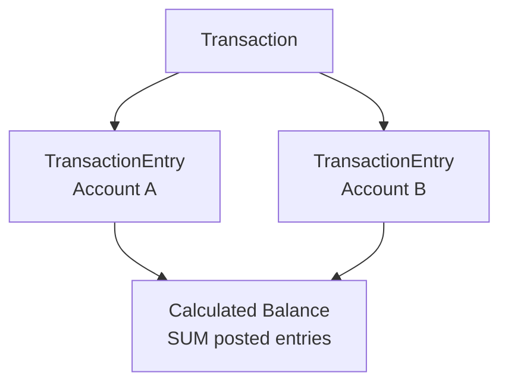
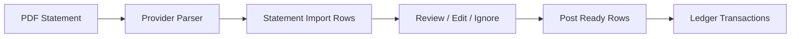

# PersonalFinanceOS

PersonalFinanceOS 是一個以 Ledger-first 架構打造的個人財務作業系統。它不是單純的記帳表單，而是希望把帳戶、信用卡、帳單、固定交易、財務任務與個人化介面整合成每天可以打開使用的工作台。

目前專案已完成 Sprint 0 到 Sprint 5.2，重點包含：帳本核心、信用卡領域模型、Richart / 玉山帳單匯入、Personal Seed、Aether MMORPG UI Framework、Quest Log 與 Workshop。

## 核心理念

- Ledger-first：所有帳戶餘額都由已入帳交易分錄即時計算，不直接儲存 current balance。
- Review before Post：PDF 帳單匯入後先進入審核列，再由使用者確認入帳。
- Forecast is not Ledger：固定交易、分期與提醒都是預測，只有使用者確認後才影響餘額。
- Local-first dogfooding：先能在本機長期真實使用，再逐步準備雲端化。
- Aether UI：財務工具可以專業，也可以像遊戲系統視窗一樣有辨識度。

## 目前功能

- 使用者註冊、登入、JWT access token 與 refresh token。
- 帳戶管理：現金、支票、儲蓄、信用卡、投資、貸款與其他帳戶。
- 分類管理：收入與支出分類、階層、封存、排序。
- 交易紀錄：收入、支出、轉帳、期初餘額、信用卡消費、退款、繳款與作廢。
- 信用卡管理：額度、帳期、已結帳、未出帳、可用額度、繳款與分期。
- Richart / 玉山 PDF 帳單匯入：解析、審核、重試、略過、入帳與匯入紀錄。
- 固定交易：週期模板、待辦 occurrence、手動入帳或略過。
- Quest Log：把即將到來的繳款、結帳、固定交易與分期整理成財務任務視窗。
- Workshop：favicon、視覺插槽、WebP 效果與本機 UI 設定。
- Aether UI Framework：Management Window、Panel Header、Metric、Toolbar、Action Bar、Empty State。
- Personal Seed：可重複執行的個人測試資料與驗證腳本。

## 系統架構



後端採 ASP.NET Core / EF Core / PostgreSQL / Redis。前端採 Next.js / React / TypeScript / Tailwind CSS。整體使用 monorepo 管理，Docker Compose 啟動本機 PostgreSQL 與 Redis。

## 技術架構

```text
personal-finance-os/
  backend/
    src/
      PersonalFinance.Api/
      PersonalFinance.Application/
      PersonalFinance.Domain/
      PersonalFinance.Infrastructure/
    tests/
  frontend/
    app/
    components/
    lib/
    public/
  docs/
    adr/
    screenshots/
  scripts/
```

主要技術：

- .NET SDK 8
- ASP.NET Core Minimal APIs
- Entity Framework Core
- PostgreSQL
- Redis
- Next.js 16
- React 19
- TypeScript
- Tailwind CSS
- Docker Compose

## 主要特色

### Ledger-first 帳本

帳戶沒有直接存餘額欄位。每一筆正式交易會建立 transaction entries，帳戶餘額由 posted entries 加總而來。



### 信用卡工作流

信用卡也是 Ledger account。消費增加信用卡負債，繳款同時降低付款帳戶資產與信用卡負債。已結帳與未出帳由帳期與交易日期計算。

### Statement Import

PDF 不會直接寫入正式交易，而是走：



### Aether UI

Sprint 5.2 後，主要頁面逐步收斂成同一套 Aether UI Framework：管理視窗、卡片槽位、任務視窗、統一指標卡、工具列、空狀態與動作列。

## 目前完成進度

- Sprint 0：專案初始化、Docker、CI、Health Check。
- Sprint 1：Authentication、Accounts、Categories。
- Sprint 2：Ledger、Transactions、Balances、Opening Balance。
- Sprint 3：Credit Cards、Payments、Refunds、Installments。
- Sprint 4：Quick Add、Recurring、Upcoming、Credit Card UX。
- Sprint 5：Richart / ESUN Statement Import、Personal Baseline Seed。
- Sprint 5.2：Aether UI Framework、Quest Log、Workshop、UI polish。
- Sprint 5.3：Documentation & Product Readiness。

## Roadmap

近期方向：

- Sprint 5.4：雲端部署準備、環境變數、備份策略、部署文件。
- Sprint 6：Dashboard 與月報表。
- Future：Budget、Goal DB、Workshop DB Sync、投資追蹤、分析報表、行動端優化。

完整 Roadmap 見 [docs/Roadmap.md](docs/Roadmap.md)。

## 開發環境

必要工具：

- Git
- Docker Desktop
- .NET SDK 8
- Node.js 22

建議先執行：

```bash
npm install
npm run setup
npm run migrate
npm run dev
```

服務位置：

```text
Frontend: http://localhost:3100
API:      http://localhost:5000
Swagger:  http://localhost:5000/swagger
Health:   http://localhost:5000/health
```

## Windows 啟動方式

```powershell
git clone https://github.com/andy-28/personal-finance-os.git
cd personal-finance-os
npm install
npm run setup
npm run migrate
npm run dev
```

也可以使用薄包裝：

```powershell
scripts\setup.ps1
```

## macOS 啟動方式

```bash
git clone https://github.com/andy-28/personal-finance-os.git
cd personal-finance-os
npm install
npm run setup
npm run migrate
npm run dev
```

也可以使用薄包裝：

```bash
./scripts/setup.sh
```

## Docker

本機 PostgreSQL 與 Redis 由 Docker Compose 啟動。預設使用避開常見衝突的 port：

```text
PostgreSQL: 55432
Redis:      56379
```

停止服務：

```bash
npm run down
```

重建本機資料庫與 Redis volume：

```bash
npm run db:reset
npm run migrate
```

## Development Seed

Development Seed 是本機開發用資料，不會在 production startup 自動執行。

```bash
npm run seed
```

預設開發帳號設定在 `backend/src/PersonalFinance.Api/appsettings.Development.json`。可以透過環境變數覆蓋：

```bash
PFOS_SEED_EMAIL=admin01@example.local PFOS_SEED_PASSWORD='your-dev-password' npm run seed
```

## Personal Seed

Personal Seed 是 dogfooding 用的個人基準資料。它是 explicit、local-only、idempotent。

PowerShell：

```powershell
$env:ALLOW_PERSONAL_SEED="true"
$env:PERSONAL_SEED_EMAIL="you@example.com"
npm run seed:personal:dry-run
npm run seed:personal
npm run verify:personal-seed
```

macOS / Linux：

```bash
export ALLOW_PERSONAL_SEED=true
export PERSONAL_SEED_EMAIL='you@example.com'
npm run seed:personal:dry-run
npm run seed:personal
npm run verify:personal-seed
```

Personal Seed 會建立或修復 seed-owned baseline，例如帳戶、分類、信用卡、期初餘額與基準交易。它不會保存 PDF 密碼，也不會保存本機絕對路徑。

## Statement Import

目前支援：

- Richart PDF Statement Import
- ESUN PDF Statement Import

匯入流程：

1. 選擇信用卡。
2. 上傳 PDF 並輸入密碼。
3. Parser 建立 statement import batch 與 rows。
4. 在 UI 檢查金額、類型與分類。
5. 將 ready rows 入帳。
6. 正式交易進入 Ledger。

PDF 密碼只存在 request 期間，不寫入 DB、不寫 log。

## Aether UI

Aether UI 是 PersonalFinanceOS 的自訂設計語言。它借鑑現代 MMORPG 系統視窗的層級感，但不使用任何遊戲官方素材。

核心元件包含：

- Aether Management Window
- Aether Panel Header
- Aether Metric
- Aether Toolbar
- Aether Action Bar
- Aether Empty State
- Game Window
- Quest Window

詳細設計見 [docs/AetherUI.md](docs/AetherUI.md)。

## Quest Log

Quest Log 把財務提醒變成可開關的任務視窗，例如信用卡結帳日、繳款日、固定交易與分期入帳。它目前是 UI/Workflow 層，不是獨立 domain。

## Workshop

Workshop 是 UI 個人化入口，目前支援 favicon、視覺插槽與 WebP 效果設定。部分設定目前存在 localStorage，未來若需要跨裝置同步，會進一步設計 Workshop DB Sync。

## 截圖

截圖資料夾已預留於：

```text
docs/screenshots/
```

建議未來補上：

- Accounts
- Credit Cards
- Quest Log
- Workshop
- Recurring
- Categories
- System Status

## 目前限制

- 尚未部署到雲端。
- 尚未建立 Dashboard 與月報表。
- Budget / Goal DB 尚未開始。
- Workshop / Goal Bar 部分資料仍是 localStorage。
- Statement Import 目前只支援已實作的銀行格式。
- 尚未導入正式 E2E 測試。

## 驗證

常用驗證：

```bash
npm run test
cd frontend
npm run lint
npx tsc --noEmit
npm run build
```

完整 backend 驗證：

```bash
cd backend
dotnet restore
dotnet build --no-restore
dotnet format --verify-no-changes --no-restore
dotnet test --no-build
```

## 文件

- [Architecture](docs/Architecture.md)
- [Ledger](docs/Ledger.md)
- [Credit Cards](docs/CreditCards.md)
- [Statement Import](docs/StatementImport.md)
- [Seed](docs/Seed.md)
- [Aether UI](docs/AetherUI.md)
- [Workshop](docs/Workshop.md)
- [Quest System](docs/QuestSystem.md)
- [Roadmap](docs/Roadmap.md)
- [Coding Guidelines](docs/CodingGuidelines.md)
- [Architecture Decision Records](docs/adr/)

## License

目前尚未指定正式 License。若未來開源或部署給他人使用，請先補上授權條款與敏感資料政策。
