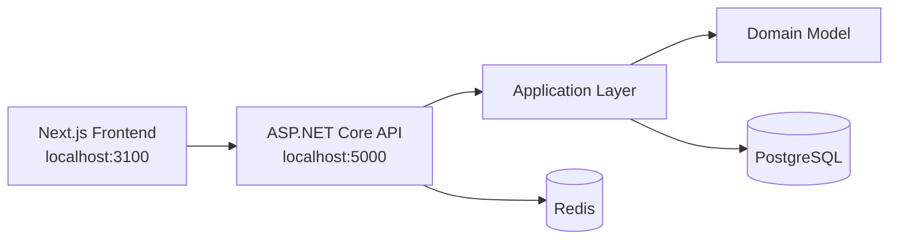
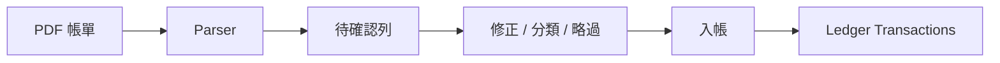

# PersonalFinanceOS

PersonalFinanceOS 是一個 Ledger-first 的個人財務系統，目標不是只記流水帳，而是建立一個可以長期維護、能匯入真實帳單、能支援跨裝置使用的個人財務作業系統。

目前專案已完成 Sprint 0 到 Sprint 5.5A 的基礎：帳戶、分類、交易紀錄、信用卡、Richart/玉山帳單匯入、Personal Seed、Aether UI Framework、Quest Log、Workshop、User Settings 雲端同步基礎，以及 production Docker/部署準備。

## 核心理念

- Ledger-first：帳戶餘額不直接儲存在帳戶上，而是由已入帳交易的分錄即時計算。
- Review before Post：PDF 帳單先解析成待確認列，再由使用者入帳，避免錯誤資料直接污染 Ledger。
- Forecast is not Ledger：分期預測與提醒不等於正式入帳，只有 Post 後才影響餘額。
- Dogfooding first：功能優先解決真實使用中的痛點。
- Aether UI：用 MMORPG 系統介面的語言做一個高資訊密度、每天可用的財務工具。
- Cloud-ready：本機優先，但架構逐步支援跨裝置同步與未來部署。

## 目前功能

- 使用者註冊、登入、JWT access token 與 refresh token。
- 帳戶管理：現金、支票帳戶、儲蓄帳戶、信用卡等。
- 分類管理：收入、支出、轉帳與待分類。
- Ledger-first 交易紀錄：收入、支出、轉帳、期初餘額、作廢。
- 信用卡管理：信用額度、已結帳應繳、未出帳、可用額度、繳款、退款、分期。
- Richart / 玉山信用卡 PDF 帳單匯入：解析、檢查、修正、略過、入帳、匯入紀錄。
- Personal Seed：可重複建立個人基準資料。
- Quick Add：快速新增日常交易。
- Recurring：固定交易模板。
- Quest Log：財務任務視窗，用於信用卡結帳/繳款提醒等任務。
- Workshop：favicon、Visual Slot、Aether 視覺設定。
- Goal Bars：像血條一樣的目標資金條。
- User Settings：Workshop、Visual Slot、Goal Bars、Theme 設定改由後端保存，作為跨裝置同步基礎。

## 系統架構



## 技術架構

- Backend：.NET 8、ASP.NET Core Minimal APIs、MediatR、EF Core、PostgreSQL、Redis。
- Frontend：Next.js、React、TypeScript、Tailwind CSS。
- DevOps：Docker Compose、production Dockerfile、GitHub Actions、root npm scripts。
- 文件：README 使用繁體中文，`docs/` 使用英文，ADR 記錄重要架構決策。

## 開發環境

必要工具：

- Git
- Docker Desktop
- .NET SDK 8
- Node.js 22

首次啟動建議流程：

```bash
npm install
npm run setup
npm run migrate
npm run dev
```

預設網址：

```text
Frontend: http://localhost:3100
API:      http://localhost:5000
Swagger:  http://localhost:5000/swagger
Health:   http://localhost:5000/health
```

## Windows 啟動方式

```powershell
git clone https://github.com/andy-28/personal-finance-os.git
cd personal-finance-os
npm install
npm run setup
npm run migrate
npm run dev
```

## macOS 啟動方式

```bash
git clone https://github.com/andy-28/personal-finance-os.git
cd personal-finance-os
npm install
npm run setup
npm run migrate
npm run dev
```

## Docker

Docker Compose 會啟動 PostgreSQL 與 Redis。開發環境預設 port 由 `.env` 或 `.env.example` 控制。Sprint 5.5A 也新增 root production `Dockerfile`，用於 Render backend Docker service。

```bash
docker compose up -d --wait
```

停止：

```bash
npm run down
```

重建資料庫 volume：

```bash
npm run db:reset
```

## Seed

Development Seed：

```bash
npm run seed
```

Personal Seed：

```bash
npm run seed:personal
npm run verify:personal-seed
```

Personal Seed 是可重複執行的基準資料機制，適合在新機器或重新建立資料庫後恢復帳戶、信用卡、分類與個人 baseline。實際日常交易不會自動寫回 seed，除非另外更新 seed script。

## Statement Import

目前支援：

- Richart 信用卡 PDF 帳單
- 玉山信用卡 PDF 帳單

匯入流程：



## Aether UI

Aether UI 是 PersonalFinanceOS 的 MMORPG System UI 設計語言。核心元件包含：

- Management Window
- Panel Header
- Metric Card
- Toolbar
- Action Bar
- Empty State
- Quest Window
- Game-style Modal
- Visual Slot
- Goal Bar

## User Settings 與 Cloud Ready

Sprint 5.4 新增 User Settings Domain，讓原本存在 localStorage 的使用者偏好改由後端保存：

- Theme
- Workshop settings
- Visual slots
- Goal bars

前端透過 SettingsProvider 統一讀取與自動儲存設定。這讓未來部署到雲端後，不同裝置登入同一帳號可以同步介面偏好。

## Cloud / Deployment 文件

相關文件：

- [Deployment](docs/Deployment.md)
- [Backup and Restore](docs/BackupRestore.md)
- [Security](docs/Security.md)
- [Cloud Readiness](docs/CloudReadiness.md)

目前 Sprint 5.5A 只完成 production deployment preparation，包含 Dockerfile、環境變數範例、production health 行為與部署文件；尚未實際建立 Render、Vercel、Neon secret 或 Upstash secret。

## 目前完成進度

- Sprint 0：專案初始化、Docker、CI、Health Check。
- Sprint 1：Authentication、Accounts、Categories。
- Sprint 2：Ledger、Transactions、Balances、Opening Balance。
- Sprint 3：Credit Cards、Payments、Refunds、Installments。
- Sprint 4：Quick Add、Recurring、Upcoming、Credit Card UX。
- Sprint 5：Richart / ESUN Statement Import、Personal Baseline Seed。
- Sprint 5.2：Aether UI Framework、Quest Log、Workshop。
- Sprint 5.3：Documentation & Product Readiness。
- Sprint 5.4：Cloud Foundation & User Personalization。
- Sprint 5.5A：Production Deployment Preparation。

## Roadmap

下一階段仍不急著新增功能，建議先依真實使用狀況決定優先順序：

- Sprint 5.5B：Neon / Render / Upstash / Vercel 實際部署。
- Sprint 5.5C：Production smoke test 與驗收。
- Sprint 6：Dashboard + 月報表。
- Future：Budget、Goal DB、Workshop DB 進階同步、Analytics、Investment、Notification、正式部署。

完整 roadmap 請見 [docs/Roadmap.md](docs/Roadmap.md)。

## 目前限制

- 尚未正式部署到 production。
- Goal Bar 已同步到 User Settings，但仍是偏好設定，不是完整 Goal Domain。
- Workshop Visual Slot 已同步設定，但素材管理仍是內建資源，不支援使用者上傳到後端。
- Dashboard、Budget、Investment 尚未開始。
- E2E 測試仍待補強。

## License

目前尚未指定正式授權。正式公開或部署前建議補上 License。
