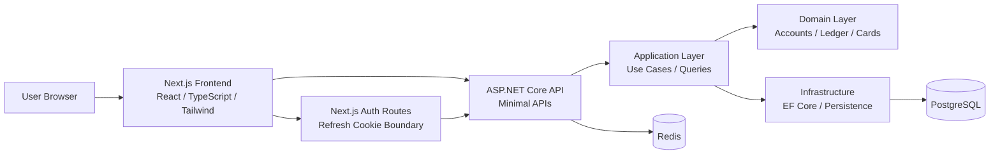
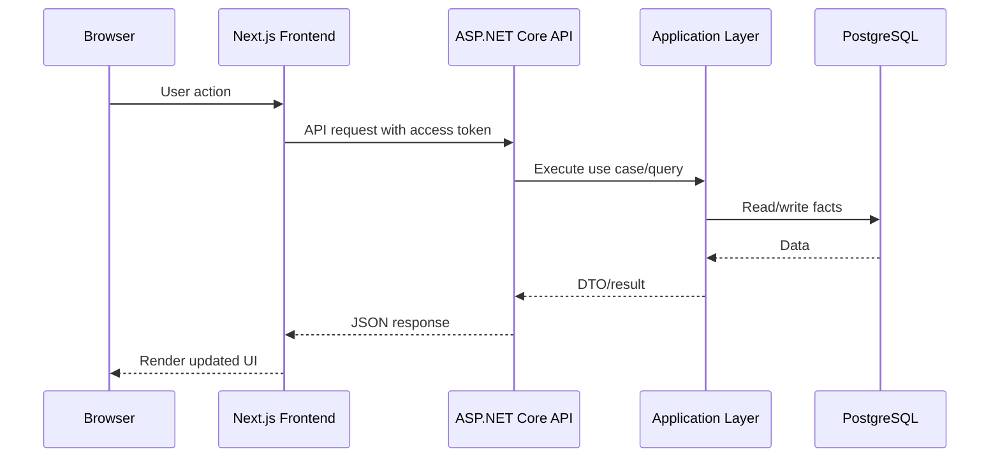
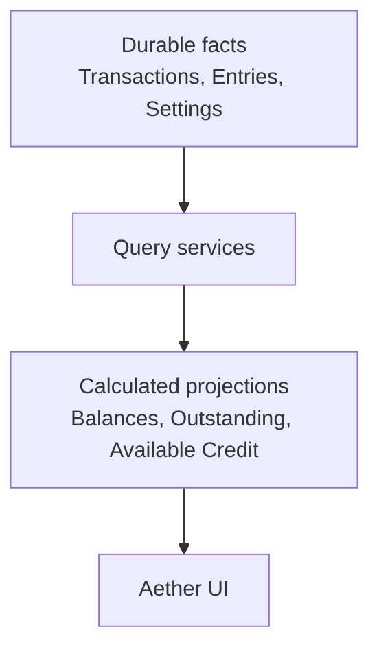

# Architecture

PersonalFinanceOS is a local-first monorepo that combines an ASP.NET Core backend, a Next.js frontend, PostgreSQL, Redis, and Docker Compose. The product is designed around a ledger-first financial model and an explicit review-first workflow for imported data.

## System Overview



## Monorepo Layout

```text
personal-finance-os/
  backend/
    src/
      PersonalFinance.Api/
      PersonalFinance.Application/
      PersonalFinance.Domain/
      PersonalFinance.Infrastructure/
    tests/
  frontend/
    app/
    components/
    lib/
    public/
  docs/
  scripts/
```

## Backend

The backend is split into four projects:

- `PersonalFinance.Api`: HTTP endpoints, auth boundary, health checks, and application startup.
- `PersonalFinance.Application`: use cases, query models, validation, and application services.
- `PersonalFinance.Domain`: core domain concepts such as accounts, transactions, credit cards, recurring templates, and statement import entities.
- `PersonalFinance.Infrastructure`: EF Core persistence, migrations, database configuration, and provider integrations.

The backend avoids storing derived balances. It stores durable facts, then calculates projections from ledger entries.

## Frontend

The frontend is a Next.js app using React, TypeScript, and Tailwind CSS. It contains:

- App routes under `frontend/app`.
- Shared UI components under `frontend/components`.
- API client, formatters, labels, and i18n utilities under `frontend/lib`.
- Static Aether assets under `frontend/public`.

The app uses a BFF-style auth helper for refresh-token cookies. Access tokens are held in memory by the frontend auth context.

## PostgreSQL

PostgreSQL is the source of truth for users, accounts, categories, transactions, statement imports, credit card settings, recurring templates, and forecast schedules.

## Redis

Redis is used by the backend infrastructure for runtime support such as health and session-related infrastructure. It is not the source of truth for financial data.

## Docker

Docker Compose starts local PostgreSQL and Redis. Local ports are intentionally offset from defaults to avoid conflicts with other projects:

```text
PostgreSQL: 55432
Redis:      56379
```

## Authentication

The application uses JWT access tokens with refresh-token rotation. Refresh tokens are handled through the frontend auth route boundary and stored in HttpOnly cookies. Production deployments must provide secure signing keys through environment variables.

## Request Flow



## Data Flow

Financial data follows a fact-to-projection model:



Derived numbers should be recalculated from facts unless there is a documented reason to cache them.
