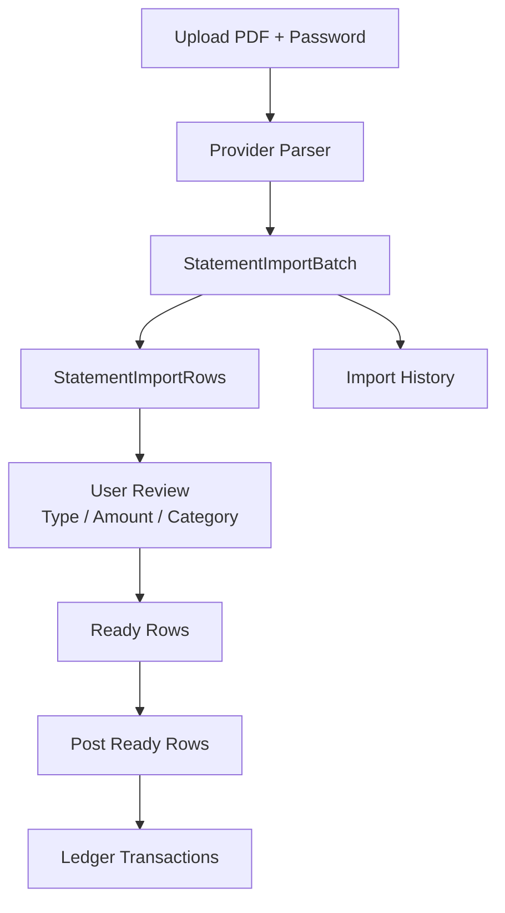

# Statement Import

Statement Import converts password-protected PDF credit card statements into reviewable rows. It does not directly post ledger transactions.

## Supported Providers

- Richart
- ESUN

Each provider has its own parser because bank statement layouts, date formats, and transaction tables differ.

## Import Flow

## Security Rules

- PDF passwords are request-only.
- Passwords are not stored in the database.
- Passwords are not logged.
- Local PDF paths are not stored.

## Richart Parser

The Richart parser handles password-protected PDFs with text layers. The implementation is designed around structured extraction and review rows because statement text can be visually ordered differently from raw text extraction.

Important considerations:

- ROC dates must be converted to Gregorian dates.
- Merchant text may contain full-width characters.
- Foreign currency rows and fees require separate classification.
- Installment future schedule summaries should not be double-posted as current charges.

## ESUN Parser

The ESUN parser handles ESUN credit card statement layout and maps rows into the same statement import review model.

## Review Rows

Rows can represent:

- Purchase
- Payment
- Refund
- Fee
- Installment
- Unknown

Rows may require category or amount correction before posting.

## Duplicate Detection

Statement rows preserve raw text and metadata so the application can detect likely duplicates. Import history and row status prevent blindly posting the same statement multiple times.

## Retry

Failed rows can be corrected and retried. Retry should operate on existing review rows rather than reparsing the whole statement unless the user uploads again.

## Discard

Discard cancels the import batch review. It should not remove already-posted ledger transactions.

## Posted

Posted rows create real ledger transactions. After posting, the transaction appears in the Ledger and affects account balances.

## Import History

Import history records parsed batches and their row state so users can see whether a statement was completed, partially posted, or still needs review.

## Design Rule

Parser output is not financial truth until reviewed and posted. The ledger remains the source of truth after posting.
